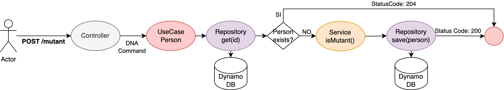

# Mutants MELI

###General Info
Magneto quiere reclutar la mayor cantidad de mutantes para poder luchar contra los X-Men.
Te ha contratado a ti para que desarrolles un proyecto que detecte si un humano es mutante
basándose en su secuencia de ADN.

###Technologies
A list of technologies used within the project:
* [Spring Boot](https://start.spring.io/) Version 2.6.6
* [Swagger](https://swagger.io/)
* [maven](http://maven.apache.org/POM/4.0.0): Version 4.0.0
* [spring-data-dynamodb](com.github.derjust): Version 5.1.0
* [aws-java-sdk-dynamodb](com.amazonaws): Version 1.12.70
* [springfox-swagger](springfox-swagger): Version 2.9.2

###Architecture
####Arquitectura Hexagonal
* Permite desacoplar los adaptadores basados en puertos, lo que simplifica realizar cambios futuros.

##General Diagram


#Flow Diagrams
### POST /mutant


### GET /stats


###Decisions

####SpringBoot
* Facilita el desarrollo soportado en anotaciones.
* Facilita la inyeccion de dependencias.

####Dynamo DB como Base de Datos
* Al ser NoSQL, permite almacenar estructuras con el formato (key : {value}).
* Permite realizar upserts.
* Esta diseñada para ejecutar aplicaciones de alto rendimiento a cualquier escala.

####AWS EC2
* Facilita la disponibilizacion de microservicios y su comunicacion con DynamoDB.

###Installation
Enter the link to access the Swagger. There they found the controllers:
* mutant
* stats

http://3.137.179.8:8080/swagger-ui.html

####Mutant

- **POST** [/mutant/]()

#### Request:

```json
{
  "dna": [
    "ATGCGA",
    "CAGTGC",
    "TTATGT",
    "AGAAGG",
    "CCCCTA",
    "TCACTG"
  ]
}
```

#### Response:

Response Code: 200
```json
N/A
```

#### Errors:

```
400 Bad Request.
204 No Content. 
500 Internal Server Error.
```

####Stats

- **GET** [/stats/]()

#### Request:

```json
N/A
```

#### Response:

Response Code: 200
```json
{
  "count_mutant_dna": 1,
  "count_human_dna": 1,
  "ratio": 1.0
}
```

#### Errors:

```
400 Bad Request.
204 No Content.
500 Internal Server Error.
```

## More Information

For more information about quasar fire MELI

* [gtv.25@hotmail.com](mailto:gtv.25@hotmail.com)
